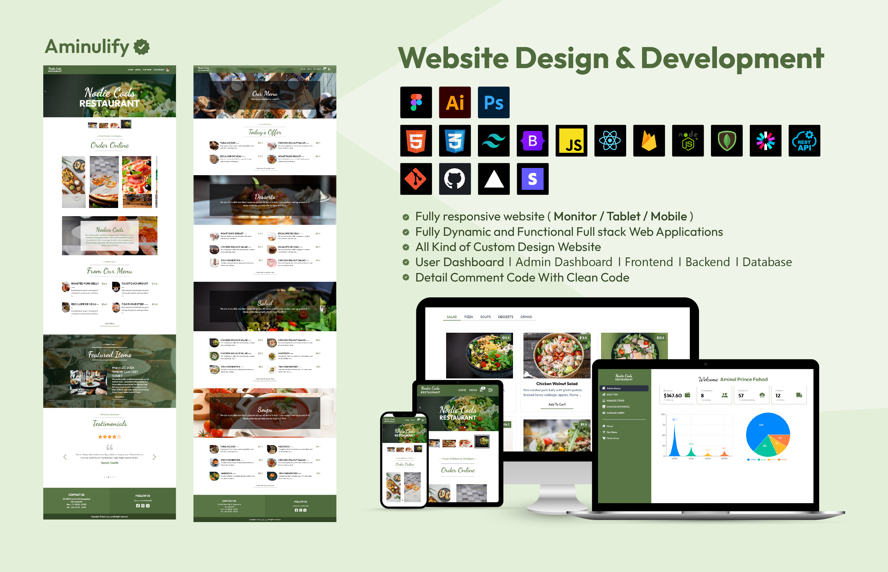

<h3>Project: Restaurant Full Stack Web Application</h3>

<b>Used Language/Library/Frameworks/Tools (Full Stack):</b> HTML5, CSS3, Tailwind CSS, React, React Router, Axios, JWT, Node Js, Express Js, MongoDB, Stripe, Render, Vercel, Github, Git

<h4>Features:</h4>
<ul type="square" style="display:flex; gap:5px; margin-bottom:10px;">
  <li>Sketched initial design on paper, finalized high-fidelity mockups on Figma, and developed a responsive UI with seamless navigation using React Router.</li>
  <li>Integrated OpenAI API for real-time text-to-image generation and built a dynamic search feature for retrieving generated images by title.</li>
  <li>Implemented a full MERN stack with RESTful APIs for image storage and retrieval, ensuring optimal performance and user experience.</li>
</ul>

<b>Nodie Cods Restaurant Live Link: </b><a href="https://openai-image-generator-6c3a8.web.app">Click Here</a> 
 

  

